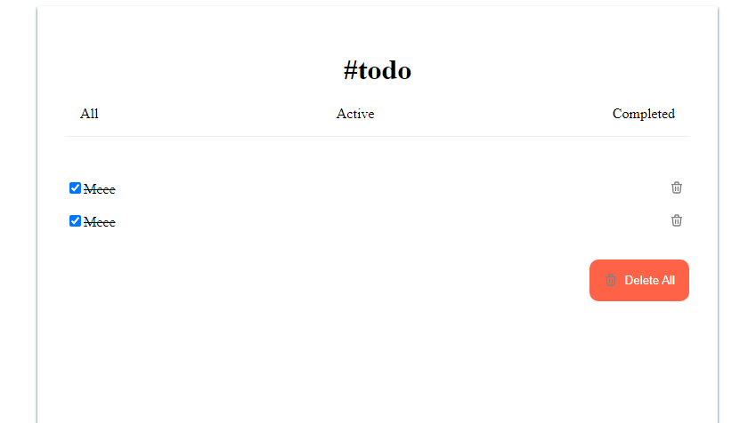

# Todo App in React


-   User story: I can add a new task
-   User story: I can complete a task
-   User story: I can toggle between All, Active and Completed
-   User story: I can remove one or all tasks under the Completed tab
-   User story (optional): Store the data in local storage that when I refresh the page I can still see my progress

<!-- Please update value in the {}  -->

<h1 align="center">React todo challenge</h1>

<div align="center">
  <h3>
    <a href="https://react-todo-sarah.netlify.app/">
      Demo
    </a>
    <span> | </span>
    <a href="https://github.com/Tsikitsiky/react-todo-challenge">
      Solution
    </a>
  </h3>
</div>

<!-- TABLE OF CONTENTS -->

## Table of Contents

-   [Overview](#overview)
    -   [Built With](#built-with)
-   [Features](#features)
-   [How to use](#how-to-use)
-   [Contact](#contact)
-   [Acknowledgements](#acknowledgements)

<!-- OVERVIEW -->

## Overview




-   The demo can be seen in [Demo](https://react-todo-sarah.netlify.app/)
-   Users can add todos in the list
-   Users can complete tasks by cheking the checkbox
-   Users can toggle between All, Active and Completed
-   Users can remove one or all tasks under the Completed tab

<!-- -   What was your e
-   What have you learned/improved?
-   Your wisdom? :) -->

### Built With

<!-- This section should list any major frameworks that you built your project using. Here are a few examples.-->

-   [React](https://reactjs.org/)
-   [React hooks](https://reactjs.org/docs/hooks-intro.html)

## Features

<!-- List the features of your application or follow the template. Don't share the figma file here :) -->

## How To Use

<!-- Example: -->

To clone and run this application, you'll need [Git](https://git-scm.com) and [Node.js](https://nodejs.org/en/download/) (which comes with [npm](http://npmjs.com)) installed on your computer. From your command line:

```bash
# Clone this repository
$ git clone https://github.com/your-user-name/your-project-name

# Install dependencies
$ npm install

# Run the app
$ npm start
```

## Acknowledgements

<!-- This section should list any articles or add-ons/plugins that helps you to complete the project. This is optional but it will help you in the future. For example: -->

## Contact

-   Website [your-website.com](https://{your-web-site-link})
-   GitHub [@your-Tsikitsiky](https://{github.com/Tsikitsiky})
-   Twitter [@your-twitter](https://{twitter.com/your-username})
